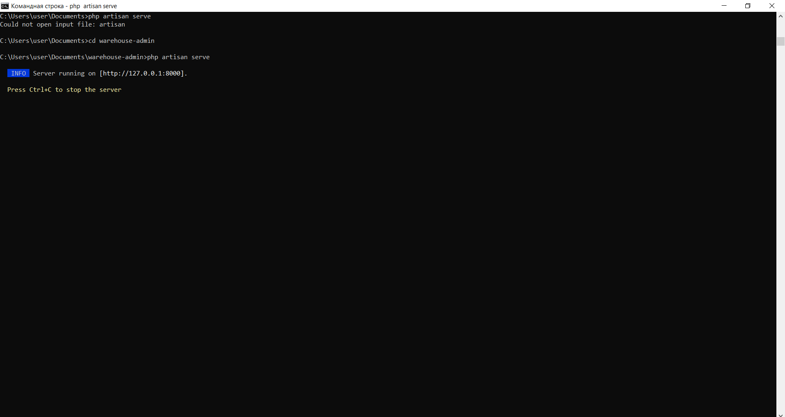
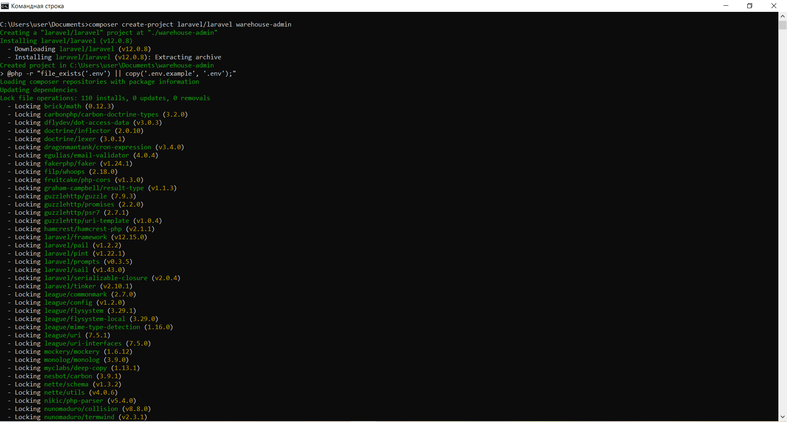
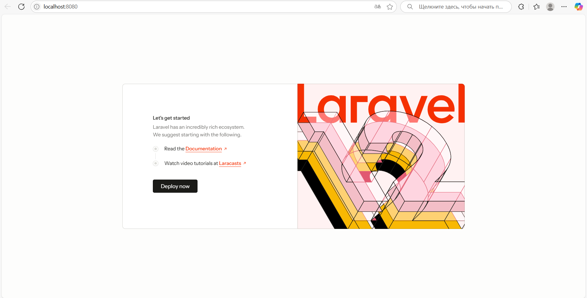

## Сегодня вы установите PHP, composer и фреймворк Laravel, а также проверите его работоспособность с помощью встроенного web-сервера.

## 1. Установите PHP на компьютер. Для этого вы можете скачать PHP с официального сайта или развернуть образ Docker с PHP. Наиболее простой способ, рекомендуемый для выполнения этого задания, — воспользоваться сборкой XAMMP. Скачать сборку для вашей платформы можно на сайте Apache Friends.

## 2. Откройте утилиту командной строки в своей операционной системе.

## 3. Выполните команду php -v и убедитесь, что PHP работает.

## 4. Установите Composer. Выполните необходимые команды, описанные на официальном сайте.

## 5. Установите Laravel с помощью Composer. Выполните команду composer create-project laravel/laravel <имя проекта>, где имя проекта — это имя вашего проекта. Этому имени будет соответствовать имя папки, куда будет помещён проект.

## 6. Перейдите в папку, соответствующую имени проекта.

## 7. Убедитесь, что папка не пустая, и выполните команду php artisan serve --port=8080. Эта команда запустит встроенный веб-сервер Laravel.

## 8. Откройте браузер и перейдите по адресу http://localhost:8080. Если всё работает правильно, вы увидите страницу с информацией о фреймворке Laravel.

## 9. Сделайте скриншот.\
